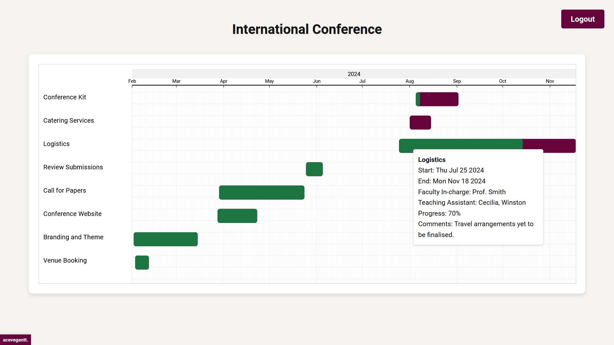
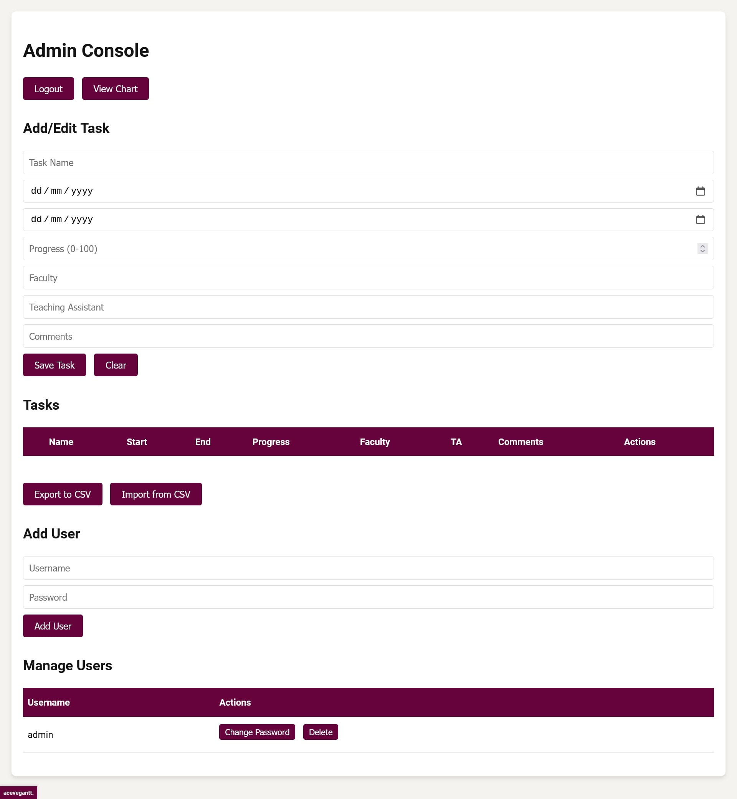

# acevegantt.
[](https://github.com/ekjaisal/acevegantt/releases) [](https://github.com/ekjaisal/acevegantt/blob/main/LICENSE) [](https://github.com/ekjaisal/acevegantt/blob/main/CITATION.cff) [](https://www.codefactor.io/repository/github/ekjaisal/acevegantt/overview/main) [](https://scorecard.dev/viewer/?uri=github.com/ekjaisal/acevegantt) [](https://github.com/ekjaisal/acevegantt/stargazers)

acevegantt is a free and open-source Gantt chart implementation for managing academic events. It provides a user-friendly interface for creating, editing, and visualising tasks in a Gantt chart format, making it ideal for planning and tracking academic conferences, workshops, and other events.





## Requirements 📋

- Node.js
- npm
- Firebase account

## Installation 🚀

1. Clone the repository:

   ```bash
   git clone https://github.com/ekjaisal/acevegantt.git
   cd acevegantt
   ```

2. Install dependencies:

   ```bash
   npm install
   ```

3. Set up Firebase:
   
   **[Firebase Console](https://console.firebase.google.com) → Create a Project →  Set up Firestore Database**
   
   Generate a new private key for the service account:
   
   **Project Settings → Service Accounts → Generate New Private Key**
   
   Save the JSON file as `serviceAccountKey.json` in the `backend` folder
   
   **Note:** Do not upload the `serviceAccountKey.json` to a public repository.
   
4. Configure environment variables:
   
   Create a `.env` file in the root directory
   
   Add the following variables:
   ```
   FIREBASE_PROJECT_ID=your-project-id
   JWT_SECRET=your-jwt-secret
   ```
   
   Replace `your-project-id` with the Firebase project ID and `your-jwt-secret` with a secure random string for JWT encryption.
   
   **Note:** Do not upload the `.env` to a public repository.

## Usage 💻

1. Start the server:

   ```bash
   npm start
   ```

2. Access the application:
   
   **Main Interface →** `http://localhost:5000`

   **Admin Panel →** `http://localhost:5000/admin`
   
3. Create an admin user:
   
   `create-admin.js` → modify `const adminUsername` and `const adminPassword` to set up the admin username and password.
   
   Run the following command to create an initial admin user:
   
   ```bash
   node create-admin.js
   ```

## Testing 🧪

To test the application locally, run:

```bash
nodemon server.js
# or
node server.js
```

## Deployment 🚀

1. Choose a hosting platform that provides a generous free tier.
2. Set up the necessary environment variables (find in .env) on the hosting platform.
3. Deploy the code following the hosting platform's guidelines.

## Third-Party Libraries and Services 🛠️

This project uses the following open-source libraries:

- [Express](https://expressjs.com/) for the web server framework,
- [Firebase Admin SDK](https://firebase.google.com/docs/admin/setup) for database and authentication,
- [bcrypt.js](https://github.com/dcodeIO/bcrypt.js) for password hashing,
- [jsonwebtoken](https://github.com/auth0/node-jsonwebtoken) for JWT authentication,
- [dotenv](https://github.com/motdotla/dotenv) for environment variable management,
- [CORS](https://github.com/expressjs/cors) for Cross-Origin Resource Sharing,
- [SortableJS](https://github.com/SortableJS/Sortable) for tasks list management, and
- [Roboto Font](https://fonts.google.com/specimen/Roboto) for UI typography.

## License 📄

This project is licensed under the BSD 3-Clause License. See the [LICENSE](LICENSE) file for details.

## Acknowledgements 🤝🏾

acevegantt has benefitted significantly from the assistance of Anthropic's [Claude 3.5 Sonnet](https://www.anthropic.com/news/claude-3-5-sonnet) with all the heavy lifting associated with coding and some of the many ideas, suggestions, and feedback from [Sarah Harniswala](https://github.com/SarahHarniswala).

<a href="https://www.buymeacoffee.com/ekjaisal" target="_blank"></a>